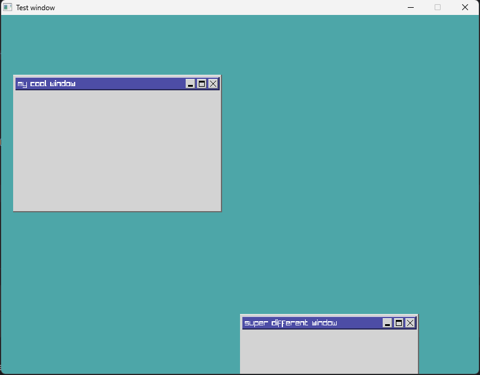

## Experimenting with raylib

This is just an experimentation with raylib to remake a cool aesthetic from old windows style
 

My experimentation goal was to provide a [MessageBox](https://learn.microsoft.com/en-us/windows/win32/api/winuser/nf-winuser-messagebox) call like WindowsApi does, just for fun and learning.

- [x] Draw simple window
- [ ] List to iterate through windows
- [ ] Moving windows with mouse input
- [ ] Closing windows
- [ ] minimizing windows (that'll require a taskbar)
